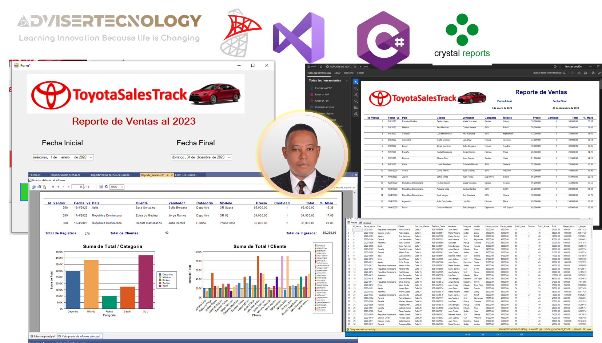
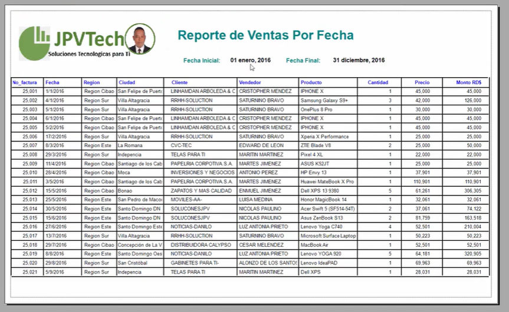

# Reporte-en-Crystal-Report-con-Procedimiento-Almacenado-en-SQL-Server.

# Proyecto de Desarrollo Empresarial - Informes Analíticos 💼

¡Bienvenidos al repositorio del Proyecto de Desarrollo Empresarial! En este emocionante proyecto, nos sumergimos en el desafiante mundo del desarrollo empresarial para diseñar un reporte parametrizado que permita realizar análisis de ventas con filtros de fecha de manera eficiente y rápida. 🚀.

## 🦾Tarea de Diseño de Reporte Parametrizado

En la empresa donde trabajas, te han asignado la tarea de diseñar un reporte parametrizado para realizar análisis de ventas con un filtro de fecha. Este reporte debe contener los siguientes encabezados:

- No_de_Factura
- Fecha
- País
- Cliente
- Vendedor
- Modelo
- Categoría
- Cantidad
- Precio
- Monto Total
- % Margen

Para llevar a cabo esta tarea, se requiere el uso de un stack de herramientas de Microsoft y SAP, específicamente con el entorno de desarrollo Visual Studio 2019 o 2022, C#, y Crystal Report. Puedes descargar Crystal Report desde la página oficial de la herramienta.

Además, se ha solicitado la incorporación de gráficos en el reporte. La tarea tiene como objetivo principal proporcionar un análisis rápido y eficiente de las ventas, con la posibilidad de filtrar por fecha.

## Requerimientos Adicionales
- Agregar la opción de fecha inicial y fecha final en el filtro.
- Permitir la generación del reporte en formato PDF.
- Habilitar la opción de exportar a Excel u otros formatos según sea necesario.

### La premisa es completar esta tarea de diseño de reporte lo más rápido posible, manteniendo la eficiencia y la calidad en el desarrollo. ¡Manos a la obra!

## 🎥 Vdeo Reporte en Crystal Report con Procedimiento Almacenado en SQL Server, C#

## 🎥 Vdeo Reporte en Crystal Report con Procedimiento Almacenado en SQL Server, VB.net

## Objetivo del Proyecto 🎯
El objetivo principal de este proyecto es desarrollar un sistema de informes analíticos que facilite el análisis inteligente de la información empresarial. Utilizaremos herramientas de Microsoft y SAP, con énfasis en Visual Studio 2019 o 2022, C#, y la poderosa Crystal Report para lograr este propósito. 🛠️

## Funcionalidades Destacadas 🌟
- **Diseño Parametrizado:** Desarrollaremos un reporte altamente parametrizado para permitir análisis de ventas con flexibilidad.
- **Integración de Herramientas:** Utilizaremos el entorno de desarrollo Visual Studio 2019 o 2022, C#, y Crystal Report para la implementación eficiente.
- **Visualización Gráfica:** Agregaremos gráficos a nuestros informes para una representación visual efectiva de los datos.
- **Manejo de Consultas SQL:** Afrontaremos el desafío de trabajar con consultas SQL y Gestor de Base de Datos de manera parametrizada.
- **Opciones de Exportación:** Proporcionaremos la capacidad de guardar informes en formato PDF o exportar a Excel.
- **Escalamiento Vertical y Horizontal:** Exploraremos las posibilidades de escalamiento vertical y horizontal para manejar grandes volúmenes de información. 📊

## Tecnologías Utilizadas 🛠️
- **Microsoft y SAP:** Herramientas líderes en el ámbito empresarial.
- **Visual Studio 2019/2022:** Entorno de desarrollo para la implementación del proyecto.
- **C#:** Lenguaje de programación principal.
- **Crystal Report:** Potente herramienta para la generación de informes.

## Instrucciones de Uso 📚
1. **Requisitos Previos:**
   - Asegúrate de tener instaladas las herramientas de Microsoft y SAP mencionadas.
   - Verifica que tengas acceso a Visual Studio 2019 o 2022.

2. **Configuración del Proyecto:**
   - Clona este repositorio en tu máquina local.
   - Abre el proyecto en Visual Studio.

3. **Implementación:**
   - Explora y modifica el código según sea necesario para adaptarse a los requisitos específicos de tu empresa.

4. **Prueba:**
   - Ejecuta el proyecto y realiza pruebas para asegurar el correcto funcionamiento del sistema de informes.

5. **Contribuciones:**
   - ¡Contribuye al desarrollo! Si encuentras mejoras o correcciones, abre un problema o presenta una solicitud de extracción.

## Suscríbete y Acompáñanos 📌
Este proyecto es parte de nuestro canal, donde la inteligencia se une a la eficiencia para potenciar el desarrollo empresarial. ¡Suscríbete y acompáñanos en este emocionante viaje de análisis inteligente de la información! 📈

✔  No olvides suscribirte, compartir, darle like y dejar tus comentarios en la sección de abajo. ¡Tu apoyo es muy importante para mí  y me ayudas a seguir creando contenido. 💚

1-🎬 Youtube: https://www.youtube.com/@JuancitoPenaV 
2-👨‍💼 LinkedIn: https://www.linkedin.com/in/juancitope%C3%B1a/
3-📰 Blog: https://advisertecnology.com/
4-📷 Instagram: https://www.instagram.com/juancito.pena.v/
5-📑 Facebook: https://www.facebook.com/juancito.p.v
6-🐦 Twitter: https://twitter.com/JuancitoPenaV

**¡Gracias por ser parte de nuestro proyecto!** 👏

